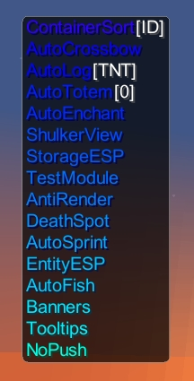
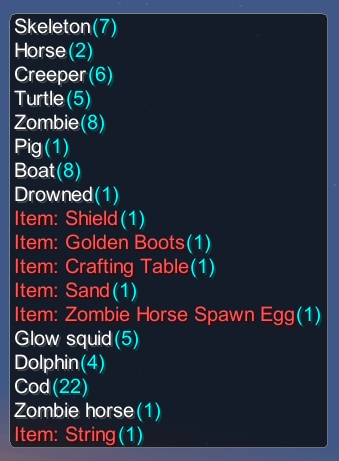

PhoenixClient is a new Minecraft Client developed for Fabric modloader for the latest versions of minecraft.
It uses mojang official mappings, not loom mappings. If you would like to build the project, there are no special plugins to do so.

The client began development on June 12th, 2024 and only has a few modules, but more are being added daily

Is the client safe? Yes. You are free to look through all of the code and assess for yourself :)

PhoenixClient has 2 main feature sets; Its Modules & Its HUD

***PhoenixClient HUD Editor***

*Controls:*
  - Hold Left Click + Drag to move window positions on screen
  - Right Click to pin/unpin windows from the HUD
  - SHIFT + Left Click any window to open the options menu
  - Hold SPACE to hope the window toggle menu. Here you can enable/disable menus from the GUI entirely
    
  *Options:*
  - Backgrounds: All windows have the option to enable/disable their backgrounds
  - Labels: Information Windows (FPS,TPS,Direction,Rotation,Speed,Coordinates,ModuleList,EntityList,StorageList,SignTextList,KeyBindList,EntityData) have the option to enable/disable their label
  - Rendering Side & Scale: List Windows (ModuleList,EntityList,StorageList,SignTextList,KeyBindList) have the option to change their scale & Rendering Side (L/R)

  *Options Menu:*
  - You are able to view all options for a particular window with SHIFT + Left Click (Described above in Controls)

  PhoenixClient HUD currently offers 16 draggable windows. Here are those windows with their custom options, excluding the universal options from above
  - **FPS**
    - 
    - Displays the frames per second
      
  - **TPS**
    - 
    - Displays the ticks per second (in single player it reads 40. IDK why)
   
  - **Direction**
    - 
    - Displays the player facing direciton
    - You can change whether or not to have compasss directions, coordinate directions, or both
    - You can change whether or not to displace NE,NW,SE,SW or just the 4 cardinal directions

  - **Rotation**
    - 
    - Displays the YAW & PITCH of the player

  - **Speed**
    - 
    - Displays the speed in m/s (Blocks Per Second)
    - You can change whether or not to have just horizontal speed (XZ) or 3D speed (XYZ)

  - **Coordinates**
    - 
    - Displays the player coordinates
    - You can choose to display nether conversion coordinates

  - **Inventory**
    - 
    - Displays the player inventory
    - You can change the scale
    - You can change the transparency of the menu

  - **Armor**
    - 
    - Displays the player's currently worn armor
    - You can change the scale

  - **ModuleList**
    - 
    - Displays all enabled modules
    - You can make it rainbow
    - You can change whether it renders from the top or the bottom

  - **EntityList**
    - 
    - Displays all nearby entities
    - You can combine all items into 1 entry, or split them apart. Split items render in RED. Shulker boxes render in PURPLE
    - You can change the range at which the list detects entities

  - **StorageList**
    - 
    - You can change the range at which the list detects storages

  - **SignTextList**
    - 
    - You can change the range at which the list detects signs
    - You can enabled the coordinates for each sign

  - **KeyBindList**
    - 
    - You can change the rendering order of the list (UP,DOWN,ABC)

  - **EntityData**
    - 
    - This window is UNFINISHED

  - **ChunkTrails**
    - 
    - I've got a lot to say about this. Ill hold off for a second

  - **Logo**
    - This just displays the PhoenixClient logo. It is enabled by default

The client has 2 GUIs

1) The Module GUI. Modules can be enabled/disabled in this menu. (Default Keybind: RCTRL)

2) The HUD GUI. HUD elements can be dragged around, pinned, and edited (Default Keybind: RALT)

